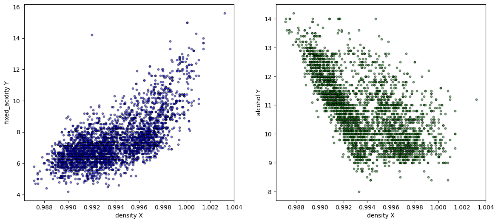
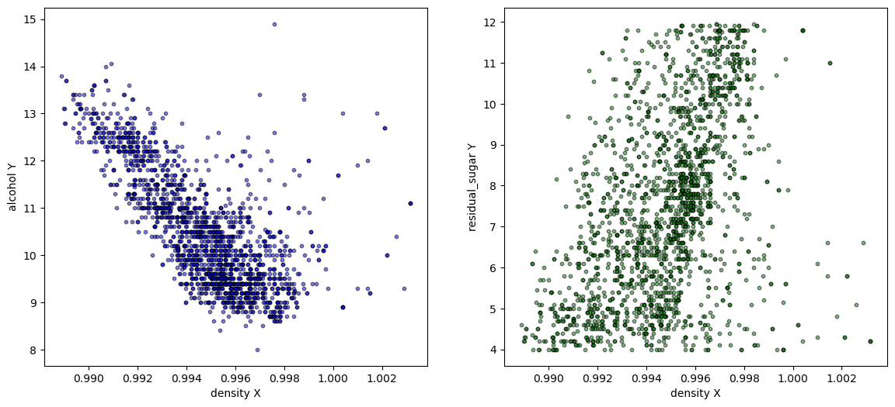
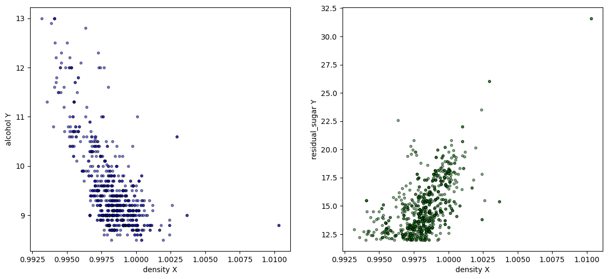
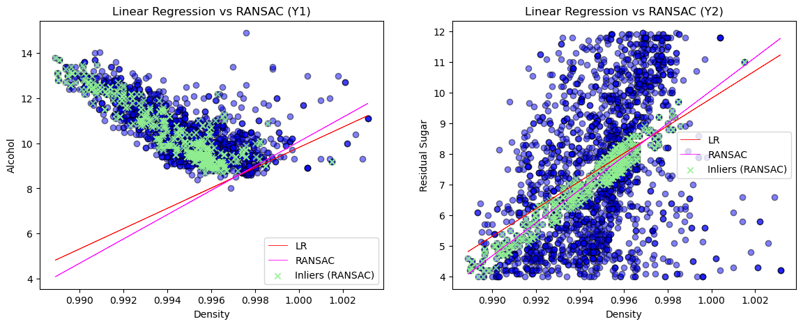

# Exploring the dataset

In ML, data visualization is essential for understanding the relationship and patterns in the dataset. Let's consider a classic example of the [Wine dataset](https://archive.ics.uci.edu/dataset/186/wine+quality), which is widely used for classification tasks.

#### 1. Install the UCI ML repo package


```python
%pip install ucimlrepo
```

    The history saving thread hit an unexpected error (OperationalError('attempt to write a readonly database')).History will not be written to the database.
    7040.62s - pydevd: Sending message related to process being replaced timed-out after 5 seconds
    Requirement already satisfied: ucimlrepo in /Users/larysasagan/anaconda3/lib/python3.11/site-packages (0.0.7)
    Requirement already satisfied: pandas>=1.0.0 in /Users/larysasagan/anaconda3/lib/python3.11/site-packages (from ucimlrepo) (1.5.3)
    Requirement already satisfied: certifi>=2020.12.5 in /Users/larysasagan/anaconda3/lib/python3.11/site-packages (from ucimlrepo) (2024.8.30)
    Requirement already satisfied: python-dateutil>=2.8.1 in /Users/larysasagan/anaconda3/lib/python3.11/site-packages (from pandas>=1.0.0->ucimlrepo) (2.8.2)
    Requirement already satisfied: pytz>=2020.1 in /Users/larysasagan/anaconda3/lib/python3.11/site-packages (from pandas>=1.0.0->ucimlrepo) (2023.3.post1)
    Requirement already satisfied: numpy>=1.21.0 in /Users/larysasagan/anaconda3/lib/python3.11/site-packages (from pandas>=1.0.0->ucimlrepo) (1.24.4)
    Requirement already satisfied: six>=1.5 in /Users/larysasagan/anaconda3/lib/python3.11/site-packages (from python-dateutil>=2.8.1->pandas>=1.0.0->ucimlrepo) (1.16.0)
    Note: you may need to restart the kernel to use updated packages.


#### 2. Import the dataset


```python
from ucimlrepo import fetch_ucirepo 

wine_quality = fetch_ucirepo(id=186)  

X = wine_quality.data.features 
```

#### 3. Selecting wine parameters

The dataset is filtered into three groups based on the `'residual_sugar'` content:
    
- `'dry'` wines have less than 4 g/L of residual sugar.
- `'semi_dry'` wines have between 4 and 12 g/L of residual sugar. 
- `'semi_sweet'` wines have between 12 and 35 g/L of residual sugar.


```python
dry=X.loc[(X['residual_sugar']<4),['density','residual_sugar','alcohol','fixed_acidity']]
semi_dry=X.loc[(X['residual_sugar']>=4) & (X['residual_sugar']<12),['density','residual_sugar','alcohol','fixed_acidity']]
semi_sweet=X.loc[(X['residual_sugar']>=12) & (X['residual_sugar']<35),['density','residual_sugar','alcohol','fixed_acidity']]
```

Only the parameters `'density'`, `'residual_sugar'`, `'alcohol'`, and `'fixed_acidity'` are selected in three groups of wines: dry, semi-dry, and semi-sweet.

#### Preliminary Data Exploration

A correlation matrix of parameters was created for each wine group. Based on this matrix, two pairs of parameters were identified in each group that might have a linear relationship.


```python
dry_corr = dry.corr().style.background_gradient(cmap='bwr',vmin=-1,vmax=1)
semi_dry_corr = semi_dry.corr().style.background_gradient(cmap='bwr',vmin=-1,vmax=1)
semi_sweet_corr = semi_sweet.corr().style.background_gradient(cmap='bwr',vmin=-1,vmax=1)
```

Correlaton matrixes for wines:


```python
from IPython.display import display

display(dry_corr, semi_dry_corr, semi_sweet_corr)

```


<style type="text/css">
#T_9b972_row0_col0, #T_9b972_row1_col1, #T_9b972_row2_col2, #T_9b972_row3_col3 {
  background-color: #ff0000;
  color: #f1f1f1;
}
#T_9b972_row0_col1, #T_9b972_row1_col0 {
  background-color: #ffb2b2;
  color: #000000;
}
#T_9b972_row0_col2, #T_9b972_row2_col0 {
  background-color: #5e5eff;
  color: #f1f1f1;
}
#T_9b972_row0_col3, #T_9b972_row3_col0 {
  background-color: #ff5252;
  color: #f1f1f1;
}
#T_9b972_row1_col2, #T_9b972_row2_col1 {
  background-color: #fff0f0;
  color: #000000;
}
#T_9b972_row1_col3, #T_9b972_row3_col1 {
  background-color: #ffcaca;
  color: #000000;
}
#T_9b972_row2_col3, #T_9b972_row3_col2 {
  background-color: #c0c0ff;
  color: #000000;
}
</style>
<table id="T_9b972">
  <thead>
    <tr>
      <th class="blank level0" >&nbsp;</th>
      <th id="T_9b972_level0_col0" class="col_heading level0 col0" >density</th>
      <th id="T_9b972_level0_col1" class="col_heading level0 col1" >residual_sugar</th>
      <th id="T_9b972_level0_col2" class="col_heading level0 col2" >alcohol</th>
      <th id="T_9b972_level0_col3" class="col_heading level0 col3" >fixed_acidity</th>
    </tr>
  </thead>
  <tbody>
    <tr>
      <th id="T_9b972_level0_row0" class="row_heading level0 row0" >density</th>
      <td id="T_9b972_row0_col0" class="data row0 col0" >1.000000</td>
      <td id="T_9b972_row0_col1" class="data row0 col1" >0.304261</td>
      <td id="T_9b972_row0_col2" class="data row0 col2" >-0.627900</td>
      <td id="T_9b972_row0_col3" class="data row0 col3" >0.675964</td>
    </tr>
    <tr>
      <th id="T_9b972_level0_row1" class="row_heading level0 row1" >residual_sugar</th>
      <td id="T_9b972_row1_col0" class="data row1 col0" >0.304261</td>
      <td id="T_9b972_row1_col1" class="data row1 col1" >1.000000</td>
      <td id="T_9b972_row1_col2" class="data row1 col2" >0.059931</td>
      <td id="T_9b972_row1_col3" class="data row1 col3" >0.207036</td>
    </tr>
    <tr>
      <th id="T_9b972_level0_row2" class="row_heading level0 row2" >alcohol</th>
      <td id="T_9b972_row2_col0" class="data row2 col0" >-0.627900</td>
      <td id="T_9b972_row2_col1" class="data row2 col1" >0.059931</td>
      <td id="T_9b972_row2_col2" class="data row2 col2" >1.000000</td>
      <td id="T_9b972_row2_col3" class="data row2 col3" >-0.243444</td>
    </tr>
    <tr>
      <th id="T_9b972_level0_row3" class="row_heading level0 row3" >fixed_acidity</th>
      <td id="T_9b972_row3_col0" class="data row3 col0" >0.675964</td>
      <td id="T_9b972_row3_col1" class="data row3 col1" >0.207036</td>
      <td id="T_9b972_row3_col2" class="data row3 col2" >-0.243444</td>
      <td id="T_9b972_row3_col3" class="data row3 col3" >1.000000</td>
    </tr>
  </tbody>
</table>


<style type="text/css">
#T_45844_row0_col0, #T_45844_row1_col1, #T_45844_row2_col2, #T_45844_row3_col3 {
  background-color: #ff0000;
  color: #f1f1f1;
}
#T_45844_row0_col1, #T_45844_row1_col0 {
  background-color: #ff8a8a;
  color: #000000;
}
#T_45844_row0_col2, #T_45844_row2_col0 {
  background-color: #4848ff;
  color: #f1f1f1;
}
#T_45844_row0_col3, #T_45844_row3_col0 {
  background-color: #ff9090;
  color: #000000;
}
#T_45844_row1_col2, #T_45844_row2_col1 {
  background-color: #aaaaff;
  color: #000000;
}
#T_45844_row1_col3, #T_45844_row3_col1 {
  background-color: #fffefe;
  color: #000000;
}
#T_45844_row2_col3, #T_45844_row3_col2 {
  background-color: #fff0f0;
  color: #000000;
}
</style>
<table id="T_45844">
  <thead>
    <tr>
      <th class="blank level0" >&nbsp;</th>
      <th id="T_45844_level0_col0" class="col_heading level0 col0" >density</th>
      <th id="T_45844_level0_col1" class="col_heading level0 col1" >residual_sugar</th>
      <th id="T_45844_level0_col2" class="col_heading level0 col2" >alcohol</th>
      <th id="T_45844_level0_col3" class="col_heading level0 col3" >fixed_acidity</th>
    </tr>
  </thead>
  <tbody>
    <tr>
      <th id="T_45844_level0_row0" class="row_heading level0 row0" >density</th>
      <td id="T_45844_row0_col0" class="data row0 col0" >1.000000</td>
      <td id="T_45844_row0_col1" class="data row0 col1" >0.454391</td>
      <td id="T_45844_row0_col2" class="data row0 col2" >-0.716689</td>
      <td id="T_45844_row0_col3" class="data row0 col3" >0.429772</td>
    </tr>
    <tr>
      <th id="T_45844_level0_row1" class="row_heading level0 row1" >residual_sugar</th>
      <td id="T_45844_row1_col0" class="data row1 col0" >0.454391</td>
      <td id="T_45844_row1_col1" class="data row1 col1" >1.000000</td>
      <td id="T_45844_row1_col2" class="data row1 col2" >-0.330627</td>
      <td id="T_45844_row1_col3" class="data row1 col3" >0.002473</td>
    </tr>
    <tr>
      <th id="T_45844_level0_row2" class="row_heading level0 row2" >alcohol</th>
      <td id="T_45844_row2_col0" class="data row2 col0" >-0.716689</td>
      <td id="T_45844_row2_col1" class="data row2 col1" >-0.330627</td>
      <td id="T_45844_row2_col2" class="data row2 col2" >1.000000</td>
      <td id="T_45844_row2_col3" class="data row2 col3" >0.060563</td>
    </tr>
    <tr>
      <th id="T_45844_level0_row3" class="row_heading level0 row3" >fixed_acidity</th>
      <td id="T_45844_row3_col0" class="data row3 col0" >0.429772</td>
      <td id="T_45844_row3_col1" class="data row3 col1" >0.002473</td>
      <td id="T_45844_row3_col2" class="data row3 col2" >0.060563</td>
      <td id="T_45844_row3_col3" class="data row3 col3" >1.000000</td>
    </tr>
  </tbody>
</table>


<style type="text/css">
#T_f998f_row0_col0, #T_f998f_row1_col1, #T_f998f_row2_col2, #T_f998f_row3_col3 {
  background-color: #ff0000;
  color: #f1f1f1;
}
#T_f998f_row0_col1, #T_f998f_row1_col0 {
  background-color: #ff6262;
  color: #f1f1f1;
}
#T_f998f_row0_col2, #T_f998f_row2_col0 {
  background-color: #5858ff;
  color: #f1f1f1;
}
#T_f998f_row0_col3, #T_f998f_row3_col0 {
  background-color: #ff9e9e;
  color: #000000;
}
#T_f998f_row1_col2, #T_f998f_row2_col1 {
  background-color: #e0e0ff;
  color: #000000;
}
#T_f998f_row1_col3, #T_f998f_row3_col1 {
  background-color: #fefeff;
  color: #000000;
}
#T_f998f_row2_col3, #T_f998f_row3_col2 {
  background-color: #e4e4ff;
  color: #000000;
}
</style>
<table id="T_f998f">
  <thead>
    <tr>
      <th class="blank level0" >&nbsp;</th>
      <th id="T_f998f_level0_col0" class="col_heading level0 col0" >density</th>
      <th id="T_f998f_level0_col1" class="col_heading level0 col1" >residual_sugar</th>
      <th id="T_f998f_level0_col2" class="col_heading level0 col2" >alcohol</th>
      <th id="T_f998f_level0_col3" class="col_heading level0 col3" >fixed_acidity</th>
    </tr>
  </thead>
  <tbody>
    <tr>
      <th id="T_f998f_level0_row0" class="row_heading level0 row0" >density</th>
      <td id="T_f998f_row0_col0" class="data row0 col0" >1.000000</td>
      <td id="T_f998f_row0_col1" class="data row0 col1" >0.610701</td>
      <td id="T_f998f_row0_col2" class="data row0 col2" >-0.653475</td>
      <td id="T_f998f_row0_col3" class="data row0 col3" >0.375626</td>
    </tr>
    <tr>
      <th id="T_f998f_level0_row1" class="row_heading level0 row1" >residual_sugar</th>
      <td id="T_f998f_row1_col0" class="data row1 col0" >0.610701</td>
      <td id="T_f998f_row1_col1" class="data row1 col1" >1.000000</td>
      <td id="T_f998f_row1_col2" class="data row1 col2" >-0.119132</td>
      <td id="T_f998f_row1_col3" class="data row1 col3" >-0.007367</td>
    </tr>
    <tr>
      <th id="T_f998f_level0_row2" class="row_heading level0 row2" >alcohol</th>
      <td id="T_f998f_row2_col0" class="data row2 col0" >-0.653475</td>
      <td id="T_f998f_row2_col1" class="data row2 col1" >-0.119132</td>
      <td id="T_f998f_row2_col2" class="data row2 col2" >1.000000</td>
      <td id="T_f998f_row2_col3" class="data row2 col3" >-0.106344</td>
    </tr>
    <tr>
      <th id="T_f998f_level0_row3" class="row_heading level0 row3" >fixed_acidity</th>
      <td id="T_f998f_row3_col0" class="data row3 col0" >0.375626</td>
      <td id="T_f998f_row3_col1" class="data row3 col1" >-0.007367</td>
      <td id="T_f998f_row3_col2" class="data row3 col2" >-0.106344</td>
      <td id="T_f998f_row3_col3" class="data row3 col3" >1.000000</td>
    </tr>
  </tbody>
</table>


Potential linear relationships in the dry wine group:

- `'density'` - `'fixed_acidity'`
- `'density'` - `'alcohol'`

Potential linear relationships in the semi-dry wine group:

- `'density'` - `'alcohol'`
- `'density'` - `'residual_sugar'`

Potential linear relationships in the semi-sweet wine group:

- `'density'` - `'alcohol'`
- `'density'` - `'residual_sugar'`

Scatter plots of the identified pairs were created for each group.


```python
plt.figure(figsize=(14, 6))

plt.subplot(121)
plt.scatter(dry.loc[:,'density'], dry.loc[:,'fixed_acidity'], color='blue', edgecolors='black', alpha=0.5, s=10)
plt.xlabel('density X')
plt.ylabel('fixed_acidity Y')

plt.subplot(122)
plt.scatter(dry.loc[:,'density'], dry.loc[:,'alcohol'], color='green', edgecolors='black', alpha=0.5, s=10)
plt.xlabel('density X')
plt.ylabel('alcohol Y')

plt.show()
```


    

    


```python
plt.figure(figsize=(14, 6))

plt.subplot(121)
plt.scatter(semi_dry.loc[:,'density'], semi_dry.loc[:,'alcohol'], color='blue', edgecolors='black', alpha=0.5, s=10)
plt.xlabel('density X')
plt.ylabel('alcohol Y')

plt.subplot(122)
plt.scatter(semi_dry.loc[:,'density'], semi_dry.loc[:,'residual_sugar'], color='green', edgecolors='black', alpha=0.5, s=10)
plt.xlabel('density X')
plt.ylabel('residual_sugar Y')

plt.show()
```


    

    


```python
plt.figure(figsize=(14, 6))

plt.subplot(121)
plt.scatter(semi_sweet.loc[:,'density'], semi_sweet.loc[:,'alcohol'], color='blue', edgecolors='black', alpha=0.5, s=10)
plt.xlabel('density X')
plt.ylabel('alcohol Y')

plt.subplot(122)
plt.scatter(semi_sweet.loc[:,'density'], semi_sweet.loc[:,'residual_sugar'], color='green', edgecolors='black', alpha=0.5, s=10)
plt.xlabel('density X')
plt.ylabel('residual_sugar Y')

plt.show()
```


    

    


#### Fitting a Trend Line for Semi-Dry Wines

In the next step of the analysis, linear regression models were created.


```python
import numpy as np
from sklearn import datasets, linear_model
from sklearn.metrics import mean_squared_error, r2_score

regr_DA = linear_model.LinearRegression()
regr_DRR = linear_model.LinearRegression(positive=True)

ransac_DA = linear_model.RANSACRegressor(residual_threshold=0.5,min_samples=200)
ransac_DRR = linear_model.RANSACRegressor(residual_threshold=0.05)
```

The models were subsequently trained on the selected pairs in the semi-dry wine group.

Performed linear regression and RANSAC regression to model the relationship between two features, `'alcohol'` and `'residual_sugar'`, and the target variable, `'density'`.


```python
X = pd.DataFrame(semi_dry.loc[:, 'density'])
Y1 = semi_dry.loc[:, 'alcohol']
Y2 = semi_dry.loc[:, 'residual_sugar']
```


```python
regr_DA_1 = regr_DA.fit(X, Y1)
regr_DRR_1 = regr_DRR.fit(X, Y1)
ransac_DA_1 = ransac_DA.fit(X, Y1)
ransac_DRR_1 = ransac_DRR.fit(X, Y1)

print('Linear slope coefficient for alcohol: ', regr_DA_1.coef_)
print('RANSAC slope coefficient for alcohol: ', ransac_DA_1.estimator_.coef_)

print('Intercept for alcohol: ', regr_DA_1.intercept_)
print('Intercept for alcohol: ', ransac_DA_1.estimator_.intercept_)

print('Linear slope coefficient for alcohol: ', regr_DRR_1.coef_)
print('RANSAC slope coefficient for alcohol: ', ransac_DRR_1.estimator_.coef_)

print('Intercept for alcohol: ', regr_DRR_1.intercept_)
print('Intercept for alcohol: ', ransac_DRR_1.estimator_.intercept_)

```

    Linear slope coefficient for alcohol:  [-383.26776856]
    RANSAC slope coefficient for alcohol:  [-494.81034954]
    Intercept for alcohol:  391.7198652132115
    Intercept for alcohol:  502.59612050011793
    Linear slope coefficient for alcohol:  [0.]
    RANSAC slope coefficient for alcohol:  [-243.13974405]
    Intercept for alcohol:  10.463697372580723
    Intercept for alcohol:  251.48149834589358


```python
regr_DA_2 = regr_DA.fit(X, Y2)
regr_DRR_2 = regr_DRR.fit(X, Y2)
ransac_DA_2 = ransac_DA.fit(X, Y2)
ransac_DRR_2 = ransac_DRR.fit(X, Y2)

print('Linear slope coefficient for residual_sugar: ', regr_DA_2.coef_)
print('RANSAC slope coefficient for residual_sugar: ', ransac_DA_2.estimator_.coef_)

print('Intercept for residual_sugar: ', regr_DA_2.intercept_)
print('Intercept for residual_sugar: ', ransac_DA_2.estimator_.intercept_)
```

    Linear slope coefficient for residual_sugar:  [449.86027435]
    RANSAC slope coefficient for residual_sugar:  [587.81632932]
    Intercept for residual_sugar:  -440.0445297898218
    Intercept for residual_sugar:  -577.5044424567469


The RANSAC slope is higher than linear what indicates that the RANSAC model may be placing more emphasis on the data points that are not outliers as RANSAC focuses on fitting the model to a subset of the data, ignoring potential outliers. 

The difference between the linear regression intercept (-440.04) and the RANSAC intercept (-530.45) suggests that while both models are finding a linear relationship between `'density'` and the target variables, they are behaving slightly differently due to their underlying methodologies.


```python
plt.figure(figsize=(14, 5))

plt.subplot(121)
plt.scatter(X, Y1, color='blue', edgecolor='black', alpha=0.5)

plt.plot(X, regr_DA_1.coef_[0] * X + regr_DA_1.intercept_, color='red', linewidth=0.6, label='LR')
plt.plot(X, ransac_DA_1.estimator_.coef_[0] * X + ransac_DA_1.estimator_.intercept_, color='magenta', linewidth=0.6, label='RANSAC')

inlier_mask_1 = ransac_DA_1.inlier_mask_
plt.scatter(X[inlier_mask_1], Y1[inlier_mask_1], color='lightgreen', marker='x', label='Inliers (RANSAC)', alpha=0.8)

plt.xlabel('Density')
plt.ylabel('Alcohol')
plt.title('Linear Regression vs RANSAC (Y1)')

plt.legend()

plt.subplot(122)
plt.scatter(X, Y2, color='blue', edgecolor='black', alpha=0.5)

plt.plot(X, regr_DA_2.coef_[0] * X + regr_DA_2.intercept_, color='red', linewidth=0.6, label='LR')
plt.plot(X, ransac_DA_2.estimator_.coef_[0] * X + ransac_DA_2.estimator_.intercept_, color='magenta', linewidth=0.6, label='RANSAC')

inlier_mask_2 = ransac_DA_2.inlier_mask_
plt.scatter(X[inlier_mask_2], Y2[inlier_mask_2], color='lightgreen', marker='x', label='Inliers (RANSAC)', alpha=0.8)

plt.xlabel('Density')
plt.ylabel('Residual Sugar')
plt.title('Linear Regression vs RANSAC (Y2)')

plt.legend()

plt.show()
```


    

    


#### Models Evaluation

The performance of both models was compared using the MSE and EVS metrics. Lower MSE values indicate better predictive accuracy. Higher EVS values suggest that the model better explains the variability of the response data around its mean.


```python
regr_DA_1_pred = regr_DA_1.predict(X)
regr_DRR_1_pred = regr_DRR_1.predict(X)
ransac_DA_1_pred = ransac_DA_1.predict(X)
ransac_DRR_1_pred = ransac_DRR_1.predict(X)

regr_DA_2_pred = regr_DA_2.predict(X)
regr_DRR_2_pred = regr_DRR_2.predict(X)
ransac_DA_2_pred = ransac_DA_2.predict(X)
ransac_DRR_2_pred = ransac_DRR_2.predict(X)
```


```python
print(f'LinearRegression (DA) MSE: {mean_squared_error(Y1, regr_DA_1_pred)}')
print(f'LinearRegression (DRR) MSE: {mean_squared_error(Y1, regr_DRR_1_pred):28}')
print(f'RANSAC (DA) MSE: {mean_squared_error(Y1, ransac_DA_1_pred):27}')
print(f'RANSAC (DRR) MSE: {mean_squared_error(Y1, ransac_DRR_1_pred):20}')

print(f'LinearRegression (DA) EVS: {r2_score(Y1, regr_DA_1_pred)}')
print(f'LinearRegression (DRR) EVS: {r2_score(Y1, regr_DRR_1_pred):30}')
print(f'RANSAC (DA) EVS: {r2_score(Y1, ransac_DA_1_pred):27}')
print(f'RANSAC (DRR) EVS: {r2_score(Y1, ransac_DRR_1_pred):22}')
```

    LinearRegression (DA) MSE: 13.192583159646102
    LinearRegression (DRR) MSE:           13.192583159646086
    RANSAC (DA) MSE:          15.852414587116073
    RANSAC (DRR) MSE:   18.979471034159907
    LinearRegression (DA) EVS: -8.288206893533287
    LinearRegression (DRR) EVS:             -8.288206893533276
    RANSAC (DA) EVS:         -10.160854903502383
    RANSAC (DRR) EVS:    -12.362451580697737


```python
print(f'LinearRegression (DA) MSE: {mean_squared_error(Y2, regr_DA_2_pred)}')
print(f'LinearRegression (DRR) MSE: {mean_squared_error(Y2, regr_DRR_2_pred):28}')
print(f'RANSAC (DA) MSE: {mean_squared_error(Y2, ransac_DA_2_pred):27}')
print(f'RANSAC (DRR) MSE: {mean_squared_error(Y2, ransac_DRR_2_pred):20}')

print(f'LinearRegression (DA) EVS: {r2_score(Y2, regr_DA_2_pred)}')
print(f'LinearRegression (DRR) EVS: {r2_score(Y2, regr_DRR_2_pred):30}')
print(f'RANSAC (DA) EVS: {r2_score(Y2, ransac_DA_2_pred):27}')
print(f'RANSAC (DRR) EVS: {r2_score(Y2, ransac_DRR_2_pred):22}')
```

    LinearRegression (DA) MSE: 3.862895641746801
    LinearRegression (DRR) MSE:            3.862895641746801
    RANSAC (DA) MSE:           4.009369174894699
    RANSAC (DRR) MSE:    6.400803646362931
    LinearRegression (DA) EVS: 0.2064712887329978
    LinearRegression (DRR) EVS:             0.2064712887329978
    RANSAC (DA) EVS:         0.17638221442887903
    RANSAC (DRR) EVS:    -0.3148741098982115

