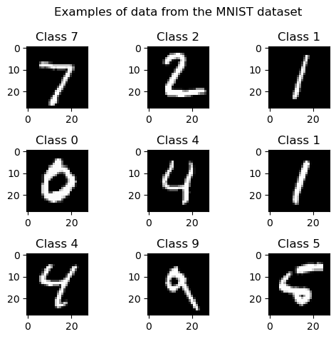

# Exploring the differences between MLP and CNN - MNIST dataset

The MNIST dataset is a labeled dataset containing grayscale images of handwritten digits, immediately available in the form of 28x28 matrices with numerical values ranging from 0 to 255. MNIST consists of 60,000 images in the training set and 10,000 images in the test set.


```python
from tensorflow.keras.datasets import mnist
```


```python
import numpy as np
import matplotlib.pyplot as plt
import tensorflow as tf

from tensorflow.keras.models import Sequential  
from tensorflow.keras.layers import Dense, Dropout, BatchNormalization, Activation, Flatten, Conv2D, AveragePooling2D
from tensorflow.python.keras.utils import np_utils
```

The data is immediately divided into training and test sets. `X_train` contains the images, while `y_train` contains the labels (similarly for `X_test` and `y_test`).


```python
(X_train, y_train), (X_test, y_test) = mnist.load_data()
```

### Visualization of example data samples


```python
plt.figure().suptitle('Examples of data from the MNIST dataset')
for i in range(9):
    plt.subplot(3,3,i+1)
    plt.imshow(X_test[i], cmap='gray', interpolation='none')
    plt.tight_layout()
    plt.title("Class {}".format(y_test[i]))
```


    

    


### Data preprocessing

Each element of the `X_train` and `X_test` datasets is a two-dimensional array. However, there is an issue: TensorFlow models require a specific three-dimensional tensor structure, where each subsequent level of the tensor contains one successive column. To achieve this, we use the `reshape` method.


```python
X_train_rsp = X_train.reshape(60000,28,28,1)
X_test_rsp = X_test.reshape(10000,28,28,1)

print("Dim X_train",X_train_rsp.shape)
print("Dim X_test",X_test_rsp.shape)
print(X_train_rsp[0])
```

    Dim X_train (60000, 28, 28, 1)
    Dim X_test (10000, 28, 28, 1)
    [[[  0]
      [  0]
      [  0]
      [  0]
      [  0]
      [  0]
      [  0]
      [  0]
      [  0]
      [  0]
      [  0]
      [  0]
      [  0]
      [  0]
      [  0]
      [  0]
      [  0]
      [  0]
      [  0]
      [  0]
      [  0]
      [  0]
      [  0]
      [  0]
      [  0]
      [  0]
      [  0]
      [  0]]
    
     [[  0]
      [  0]
      [  0]
      [  0]
      [  0]
      [  0]
      [  0]
      [  0]
      [  0]
      [  0]
      [  0]
      [  0]
      [  0]
      [  0]
      [  0]
      [  0]
      [  0]
      [  0]
      [  0]
      [  0]
      [  0]
      [  0]
      [  0]
      [  0]
      [  0]
      [  0]
      [  0]
      [  0]]
    
     [[  0]
      [  0]
      [  0]
      [  0]
      [  0]
      [  0]
      [  0]
      [  0]
      [  0]
      [  0]
      [  0]
      [  0]
      [  0]
      [  0]
      [  0]
      [  0]
      [  0]
      [  0]
      [  0]
      [  0]
      [  0]
      [  0]
      [  0]
      [  0]
      [  0]
      [  0]
      [  0]
      [  0]]
    
     [[  0]
      [  0]
      [  0]
      [  0]
      [  0]
      [  0]
      [  0]
      [  0]
      [  0]
      [  0]
      [  0]
      [  0]
      [  0]
      [  0]
      [  0]
      [  0]
      [  0]
      [  0]
      [  0]
      [  0]
      [  0]
      [  0]
      [  0]
      [  0]
      [  0]
      [  0]
      [  0]
      [  0]]
    
     [[  0]
      [  0]
      [  0]
      [  0]
      [  0]
      [  0]
      [  0]
      [  0]
      [  0]
      [  0]
      [  0]
      [  0]
      [  0]
      [  0]
      [  0]
      [  0]
      [  0]
      [  0]
      [  0]
      [  0]
      [  0]
      [  0]
      [  0]
      [  0]
      [  0]
      [  0]
      [  0]
      [  0]]
    
     [[  0]
      [  0]
      [  0]
      [  0]
      [  0]
      [  0]
      [  0]
      [  0]
      [  0]
      [  0]
      [  0]
      [  0]
      [  3]
      [ 18]
      [ 18]
      [ 18]
      [126]
      [136]
      [175]
      [ 26]
      [166]
      [255]
      [247]
      [127]
      [  0]
      [  0]
      [  0]
      [  0]]
    
     [[  0]
      [  0]
      [  0]
      [  0]
      [  0]
      [  0]
      [  0]
      [  0]
      [ 30]
      [ 36]
      [ 94]
      [154]
      [170]
      [253]
      [253]
      [253]
      [253]
      [253]
      [225]
      [172]
      [253]
      [242]
      [195]
      [ 64]
      [  0]
      [  0]
      [  0]
      [  0]]
    
     [[  0]
      [  0]
      [  0]
      [  0]
      [  0]
      [  0]
      [  0]
      [ 49]
      [238]
      [253]
      [253]
      [253]
      [253]
      [253]
      [253]
      [253]
      [253]
      [251]
      [ 93]
      [ 82]
      [ 82]
      [ 56]
      [ 39]
      [  0]
      [  0]
      [  0]
      [  0]
      [  0]]
    
     [[  0]
      [  0]
      [  0]
      [  0]
      [  0]
      [  0]
      [  0]
      [ 18]
      [219]
      [253]
      [253]
      [253]
      [253]
      [253]
      [198]
      [182]
      [247]
      [241]
      [  0]
      [  0]
      [  0]
      [  0]
      [  0]
      [  0]
      [  0]
      [  0]
      [  0]
      [  0]]
    
     [[  0]
      [  0]
      [  0]
      [  0]
      [  0]
      [  0]
      [  0]
      [  0]
      [ 80]
      [156]
      [107]
      [253]
      [253]
      [205]
      [ 11]
      [  0]
      [ 43]
      [154]
      [  0]
      [  0]
      [  0]
      [  0]
      [  0]
      [  0]
      [  0]
      [  0]
      [  0]
      [  0]]
    
     [[  0]
      [  0]
      [  0]
      [  0]
      [  0]
      [  0]
      [  0]
      [  0]
      [  0]
      [ 14]
      [  1]
      [154]
      [253]
      [ 90]
      [  0]
      [  0]
      [  0]
      [  0]
      [  0]
      [  0]
      [  0]
      [  0]
      [  0]
      [  0]
      [  0]
      [  0]
      [  0]
      [  0]]
    
     [[  0]
      [  0]
      [  0]
      [  0]
      [  0]
      [  0]
      [  0]
      [  0]
      [  0]
      [  0]
      [  0]
      [139]
      [253]
      [190]
      [  2]
      [  0]
      [  0]
      [  0]
      [  0]
      [  0]
      [  0]
      [  0]
      [  0]
      [  0]
      [  0]
      [  0]
      [  0]
      [  0]]
    
     [[  0]
      [  0]
      [  0]
      [  0]
      [  0]
      [  0]
      [  0]
      [  0]
      [  0]
      [  0]
      [  0]
      [ 11]
      [190]
      [253]
      [ 70]
      [  0]
      [  0]
      [  0]
      [  0]
      [  0]
      [  0]
      [  0]
      [  0]
      [  0]
      [  0]
      [  0]
      [  0]
      [  0]]
    
     [[  0]
      [  0]
      [  0]
      [  0]
      [  0]
      [  0]
      [  0]
      [  0]
      [  0]
      [  0]
      [  0]
      [  0]
      [ 35]
      [241]
      [225]
      [160]
      [108]
      [  1]
      [  0]
      [  0]
      [  0]
      [  0]
      [  0]
      [  0]
      [  0]
      [  0]
      [  0]
      [  0]]
    
     [[  0]
      [  0]
      [  0]
      [  0]
      [  0]
      [  0]
      [  0]
      [  0]
      [  0]
      [  0]
      [  0]
      [  0]
      [  0]
      [ 81]
      [240]
      [253]
      [253]
      [119]
      [ 25]
      [  0]
      [  0]
      [  0]
      [  0]
      [  0]
      [  0]
      [  0]
      [  0]
      [  0]]
    
     [[  0]
      [  0]
      [  0]
      [  0]
      [  0]
      [  0]
      [  0]
      [  0]
      [  0]
      [  0]
      [  0]
      [  0]
      [  0]
      [  0]
      [ 45]
      [186]
      [253]
      [253]
      [150]
      [ 27]
      [  0]
      [  0]
      [  0]
      [  0]
      [  0]
      [  0]
      [  0]
      [  0]]
    
     [[  0]
      [  0]
      [  0]
      [  0]
      [  0]
      [  0]
      [  0]
      [  0]
      [  0]
      [  0]
      [  0]
      [  0]
      [  0]
      [  0]
      [  0]
      [ 16]
      [ 93]
      [252]
      [253]
      [187]
      [  0]
      [  0]
      [  0]
      [  0]
      [  0]
      [  0]
      [  0]
      [  0]]
    
     [[  0]
      [  0]
      [  0]
      [  0]
      [  0]
      [  0]
      [  0]
      [  0]
      [  0]
      [  0]
      [  0]
      [  0]
      [  0]
      [  0]
      [  0]
      [  0]
      [  0]
      [249]
      [253]
      [249]
      [ 64]
      [  0]
      [  0]
      [  0]
      [  0]
      [  0]
      [  0]
      [  0]]
    
     [[  0]
      [  0]
      [  0]
      [  0]
      [  0]
      [  0]
      [  0]
      [  0]
      [  0]
      [  0]
      [  0]
      [  0]
      [  0]
      [  0]
      [ 46]
      [130]
      [183]
      [253]
      [253]
      [207]
      [  2]
      [  0]
      [  0]
      [  0]
      [  0]
      [  0]
      [  0]
      [  0]]
    
     [[  0]
      [  0]
      [  0]
      [  0]
      [  0]
      [  0]
      [  0]
      [  0]
      [  0]
      [  0]
      [  0]
      [  0]
      [ 39]
      [148]
      [229]
      [253]
      [253]
      [253]
      [250]
      [182]
      [  0]
      [  0]
      [  0]
      [  0]
      [  0]
      [  0]
      [  0]
      [  0]]
    
     [[  0]
      [  0]
      [  0]
      [  0]
      [  0]
      [  0]
      [  0]
      [  0]
      [  0]
      [  0]
      [ 24]
      [114]
      [221]
      [253]
      [253]
      [253]
      [253]
      [201]
      [ 78]
      [  0]
      [  0]
      [  0]
      [  0]
      [  0]
      [  0]
      [  0]
      [  0]
      [  0]]
    
     [[  0]
      [  0]
      [  0]
      [  0]
      [  0]
      [  0]
      [  0]
      [  0]
      [ 23]
      [ 66]
      [213]
      [253]
      [253]
      [253]
      [253]
      [198]
      [ 81]
      [  2]
      [  0]
      [  0]
      [  0]
      [  0]
      [  0]
      [  0]
      [  0]
      [  0]
      [  0]
      [  0]]
    
     [[  0]
      [  0]
      [  0]
      [  0]
      [  0]
      [  0]
      [ 18]
      [171]
      [219]
      [253]
      [253]
      [253]
      [253]
      [195]
      [ 80]
      [  9]
      [  0]
      [  0]
      [  0]
      [  0]
      [  0]
      [  0]
      [  0]
      [  0]
      [  0]
      [  0]
      [  0]
      [  0]]
    
     [[  0]
      [  0]
      [  0]
      [  0]
      [ 55]
      [172]
      [226]
      [253]
      [253]
      [253]
      [253]
      [244]
      [133]
      [ 11]
      [  0]
      [  0]
      [  0]
      [  0]
      [  0]
      [  0]
      [  0]
      [  0]
      [  0]
      [  0]
      [  0]
      [  0]
      [  0]
      [  0]]
    
     [[  0]
      [  0]
      [  0]
      [  0]
      [136]
      [253]
      [253]
      [253]
      [212]
      [135]
      [132]
      [ 16]
      [  0]
      [  0]
      [  0]
      [  0]
      [  0]
      [  0]
      [  0]
      [  0]
      [  0]
      [  0]
      [  0]
      [  0]
      [  0]
      [  0]
      [  0]
      [  0]]
    
     [[  0]
      [  0]
      [  0]
      [  0]
      [  0]
      [  0]
      [  0]
      [  0]
      [  0]
      [  0]
      [  0]
      [  0]
      [  0]
      [  0]
      [  0]
      [  0]
      [  0]
      [  0]
      [  0]
      [  0]
      [  0]
      [  0]
      [  0]
      [  0]
      [  0]
      [  0]
      [  0]
      [  0]]
    
     [[  0]
      [  0]
      [  0]
      [  0]
      [  0]
      [  0]
      [  0]
      [  0]
      [  0]
      [  0]
      [  0]
      [  0]
      [  0]
      [  0]
      [  0]
      [  0]
      [  0]
      [  0]
      [  0]
      [  0]
      [  0]
      [  0]
      [  0]
      [  0]
      [  0]
      [  0]
      [  0]
      [  0]]
    
     [[  0]
      [  0]
      [  0]
      [  0]
      [  0]
      [  0]
      [  0]
      [  0]
      [  0]
      [  0]
      [  0]
      [  0]
      [  0]
      [  0]
      [  0]
      [  0]
      [  0]
      [  0]
      [  0]
      [  0]
      [  0]
      [  0]
      [  0]
      [  0]
      [  0]
      [  0]
      [  0]
      [  0]]]


Another necessary modification is scaling the values in `X_train` and `X_test`, meaning transforming them into the $[0, 1]$ range. To achieve this, we convert the data type to floating-point and divide each value by the maximum possible value, which is 255. This can be done manually or by adding a scaling layer, tf.keras.layers.Rescaling(), to the model.


```python
X_train_flt = X_train_rsp.astype('float32')
X_test_flt = X_test_rsp.astype('float32')

X_train = X_train_flt/255
X_test = X_test_flt/255

print(X_train[1])
```

    [[[0.        ]
      [0.        ]
      [0.        ]
      [0.        ]
      [0.        ]
      [0.        ]
      [0.        ]
      [0.        ]
      [0.        ]
      [0.        ]
      [0.        ]
      [0.        ]
      [0.        ]
      [0.        ]
      [0.        ]
      [0.        ]
      [0.        ]
      [0.        ]
      [0.        ]
      [0.        ]
      [0.        ]
      [0.        ]
      [0.        ]
      [0.        ]
      [0.        ]
      [0.        ]
      [0.        ]
      [0.        ]]
    
     [[0.        ]
      [0.        ]
      [0.        ]
      [0.        ]
      [0.        ]
      [0.        ]
      [0.        ]
      [0.        ]
      [0.        ]
      [0.        ]
      [0.        ]
      [0.        ]
      [0.        ]
      [0.        ]
      [0.        ]
      [0.        ]
      [0.        ]
      [0.        ]
      [0.        ]
      [0.        ]
      [0.        ]
      [0.        ]
      [0.        ]
      [0.        ]
      [0.        ]
      [0.        ]
      [0.        ]
      [0.        ]]
    
     [[0.        ]
      [0.        ]
      [0.        ]
      [0.        ]
      [0.        ]
      [0.        ]
      [0.        ]
      [0.        ]
      [0.        ]
      [0.        ]
      [0.        ]
      [0.        ]
      [0.        ]
      [0.        ]
      [0.        ]
      [0.        ]
      [0.        ]
      [0.        ]
      [0.        ]
      [0.        ]
      [0.        ]
      [0.        ]
      [0.        ]
      [0.        ]
      [0.        ]
      [0.        ]
      [0.        ]
      [0.        ]]
    
     [[0.        ]
      [0.        ]
      [0.        ]
      [0.        ]
      [0.        ]
      [0.        ]
      [0.        ]
      [0.        ]
      [0.        ]
      [0.        ]
      [0.        ]
      [0.        ]
      [0.        ]
      [0.        ]
      [0.        ]
      [0.        ]
      [0.        ]
      [0.        ]
      [0.        ]
      [0.        ]
      [0.        ]
      [0.        ]
      [0.        ]
      [0.        ]
      [0.        ]
      [0.        ]
      [0.        ]
      [0.        ]]
    
     [[0.        ]
      [0.        ]
      [0.        ]
      [0.        ]
      [0.        ]
      [0.        ]
      [0.        ]
      [0.        ]
      [0.        ]
      [0.        ]
      [0.        ]
      [0.        ]
      [0.        ]
      [0.        ]
      [0.        ]
      [0.2       ]
      [0.62352943]
      [0.99215686]
      [0.62352943]
      [0.19607843]
      [0.        ]
      [0.        ]
      [0.        ]
      [0.        ]
      [0.        ]
      [0.        ]
      [0.        ]
      [0.        ]]
    
     [[0.        ]
      [0.        ]
      [0.        ]
      [0.        ]
      [0.        ]
      [0.        ]
      [0.        ]
      [0.        ]
      [0.        ]
      [0.        ]
      [0.        ]
      [0.        ]
      [0.        ]
      [0.        ]
      [0.1882353 ]
      [0.93333334]
      [0.9882353 ]
      [0.9882353 ]
      [0.9882353 ]
      [0.92941177]
      [0.        ]
      [0.        ]
      [0.        ]
      [0.        ]
      [0.        ]
      [0.        ]
      [0.        ]
      [0.        ]]
    
     [[0.        ]
      [0.        ]
      [0.        ]
      [0.        ]
      [0.        ]
      [0.        ]
      [0.        ]
      [0.        ]
      [0.        ]
      [0.        ]
      [0.        ]
      [0.        ]
      [0.        ]
      [0.21176471]
      [0.8901961 ]
      [0.99215686]
      [0.9882353 ]
      [0.9372549 ]
      [0.9137255 ]
      [0.9882353 ]
      [0.22352941]
      [0.02352941]
      [0.        ]
      [0.        ]
      [0.        ]
      [0.        ]
      [0.        ]
      [0.        ]]
    
     [[0.        ]
      [0.        ]
      [0.        ]
      [0.        ]
      [0.        ]
      [0.        ]
      [0.        ]
      [0.        ]
      [0.        ]
      [0.        ]
      [0.        ]
      [0.03921569]
      [0.23529412]
      [0.8784314 ]
      [0.9882353 ]
      [0.99215686]
      [0.9882353 ]
      [0.7921569 ]
      [0.32941177]
      [0.9882353 ]
      [0.99215686]
      [0.47843137]
      [0.        ]
      [0.        ]
      [0.        ]
      [0.        ]
      [0.        ]
      [0.        ]]
    
     [[0.        ]
      [0.        ]
      [0.        ]
      [0.        ]
      [0.        ]
      [0.        ]
      [0.        ]
      [0.        ]
      [0.        ]
      [0.        ]
      [0.        ]
      [0.6392157 ]
      [0.9882353 ]
      [0.9882353 ]
      [0.9882353 ]
      [0.99215686]
      [0.9882353 ]
      [0.9882353 ]
      [0.3764706 ]
      [0.7411765 ]
      [0.99215686]
      [0.654902  ]
      [0.        ]
      [0.        ]
      [0.        ]
      [0.        ]
      [0.        ]
      [0.        ]]
    
     [[0.        ]
      [0.        ]
      [0.        ]
      [0.        ]
      [0.        ]
      [0.        ]
      [0.        ]
      [0.        ]
      [0.        ]
      [0.        ]
      [0.2       ]
      [0.93333334]
      [0.99215686]
      [0.99215686]
      [0.74509805]
      [0.44705883]
      [0.99215686]
      [0.89411765]
      [0.18431373]
      [0.30980393]
      [1.        ]
      [0.65882355]
      [0.        ]
      [0.        ]
      [0.        ]
      [0.        ]
      [0.        ]
      [0.        ]]
    
     [[0.        ]
      [0.        ]
      [0.        ]
      [0.        ]
      [0.        ]
      [0.        ]
      [0.        ]
      [0.        ]
      [0.        ]
      [0.1882353 ]
      [0.93333334]
      [0.9882353 ]
      [0.9882353 ]
      [0.7019608 ]
      [0.04705882]
      [0.29411766]
      [0.4745098 ]
      [0.08235294]
      [0.        ]
      [0.        ]
      [0.99215686]
      [0.9529412 ]
      [0.19607843]
      [0.        ]
      [0.        ]
      [0.        ]
      [0.        ]
      [0.        ]]
    
     [[0.        ]
      [0.        ]
      [0.        ]
      [0.        ]
      [0.        ]
      [0.        ]
      [0.        ]
      [0.        ]
      [0.14901961]
      [0.64705884]
      [0.99215686]
      [0.9137255 ]
      [0.8156863 ]
      [0.32941177]
      [0.        ]
      [0.        ]
      [0.        ]
      [0.        ]
      [0.        ]
      [0.        ]
      [0.99215686]
      [0.9882353 ]
      [0.64705884]
      [0.        ]
      [0.        ]
      [0.        ]
      [0.        ]
      [0.        ]]
    
     [[0.        ]
      [0.        ]
      [0.        ]
      [0.        ]
      [0.        ]
      [0.        ]
      [0.        ]
      [0.02745098]
      [0.69803923]
      [0.9882353 ]
      [0.9411765 ]
      [0.2784314 ]
      [0.07450981]
      [0.10980392]
      [0.        ]
      [0.        ]
      [0.        ]
      [0.        ]
      [0.        ]
      [0.        ]
      [0.99215686]
      [0.9882353 ]
      [0.7647059 ]
      [0.        ]
      [0.        ]
      [0.        ]
      [0.        ]
      [0.        ]]
    
     [[0.        ]
      [0.        ]
      [0.        ]
      [0.        ]
      [0.        ]
      [0.        ]
      [0.        ]
      [0.22352941]
      [0.9882353 ]
      [0.9882353 ]
      [0.24705882]
      [0.        ]
      [0.        ]
      [0.        ]
      [0.        ]
      [0.        ]
      [0.        ]
      [0.        ]
      [0.        ]
      [0.        ]
      [0.99215686]
      [0.9882353 ]
      [0.7647059 ]
      [0.        ]
      [0.        ]
      [0.        ]
      [0.        ]
      [0.        ]]
    
     [[0.        ]
      [0.        ]
      [0.        ]
      [0.        ]
      [0.        ]
      [0.        ]
      [0.        ]
      [0.7764706 ]
      [0.99215686]
      [0.74509805]
      [0.        ]
      [0.        ]
      [0.        ]
      [0.        ]
      [0.        ]
      [0.        ]
      [0.        ]
      [0.        ]
      [0.        ]
      [0.        ]
      [1.        ]
      [0.99215686]
      [0.76862746]
      [0.        ]
      [0.        ]
      [0.        ]
      [0.        ]
      [0.        ]]
    
     [[0.        ]
      [0.        ]
      [0.        ]
      [0.        ]
      [0.        ]
      [0.        ]
      [0.29803923]
      [0.9647059 ]
      [0.9882353 ]
      [0.4392157 ]
      [0.        ]
      [0.        ]
      [0.        ]
      [0.        ]
      [0.        ]
      [0.        ]
      [0.        ]
      [0.        ]
      [0.        ]
      [0.        ]
      [0.99215686]
      [0.9882353 ]
      [0.5803922 ]
      [0.        ]
      [0.        ]
      [0.        ]
      [0.        ]
      [0.        ]]
    
     [[0.        ]
      [0.        ]
      [0.        ]
      [0.        ]
      [0.        ]
      [0.        ]
      [0.33333334]
      [0.9882353 ]
      [0.9019608 ]
      [0.09803922]
      [0.        ]
      [0.        ]
      [0.        ]
      [0.        ]
      [0.        ]
      [0.        ]
      [0.        ]
      [0.        ]
      [0.02745098]
      [0.5294118 ]
      [0.99215686]
      [0.7294118 ]
      [0.04705882]
      [0.        ]
      [0.        ]
      [0.        ]
      [0.        ]
      [0.        ]]
    
     [[0.        ]
      [0.        ]
      [0.        ]
      [0.        ]
      [0.        ]
      [0.        ]
      [0.33333334]
      [0.9882353 ]
      [0.8745098 ]
      [0.        ]
      [0.        ]
      [0.        ]
      [0.        ]
      [0.        ]
      [0.        ]
      [0.        ]
      [0.        ]
      [0.02745098]
      [0.5137255 ]
      [0.9882353 ]
      [0.88235295]
      [0.2784314 ]
      [0.        ]
      [0.        ]
      [0.        ]
      [0.        ]
      [0.        ]
      [0.        ]]
    
     [[0.        ]
      [0.        ]
      [0.        ]
      [0.        ]
      [0.        ]
      [0.        ]
      [0.33333334]
      [0.9882353 ]
      [0.5686275 ]
      [0.        ]
      [0.        ]
      [0.        ]
      [0.        ]
      [0.        ]
      [0.        ]
      [0.        ]
      [0.1882353 ]
      [0.64705884]
      [0.9882353 ]
      [0.6784314 ]
      [0.        ]
      [0.        ]
      [0.        ]
      [0.        ]
      [0.        ]
      [0.        ]
      [0.        ]
      [0.        ]]
    
     [[0.        ]
      [0.        ]
      [0.        ]
      [0.        ]
      [0.        ]
      [0.        ]
      [0.3372549 ]
      [0.99215686]
      [0.88235295]
      [0.        ]
      [0.        ]
      [0.        ]
      [0.        ]
      [0.        ]
      [0.        ]
      [0.44705883]
      [0.93333334]
      [0.99215686]
      [0.63529414]
      [0.        ]
      [0.        ]
      [0.        ]
      [0.        ]
      [0.        ]
      [0.        ]
      [0.        ]
      [0.        ]
      [0.        ]]
    
     [[0.        ]
      [0.        ]
      [0.        ]
      [0.        ]
      [0.        ]
      [0.        ]
      [0.33333334]
      [0.9882353 ]
      [0.9764706 ]
      [0.57254905]
      [0.1882353 ]
      [0.11372549]
      [0.33333334]
      [0.69803923]
      [0.88235295]
      [0.99215686]
      [0.8745098 ]
      [0.654902  ]
      [0.21960784]
      [0.        ]
      [0.        ]
      [0.        ]
      [0.        ]
      [0.        ]
      [0.        ]
      [0.        ]
      [0.        ]
      [0.        ]]
    
     [[0.        ]
      [0.        ]
      [0.        ]
      [0.        ]
      [0.        ]
      [0.        ]
      [0.33333334]
      [0.9882353 ]
      [0.9882353 ]
      [0.9882353 ]
      [0.8980392 ]
      [0.84313726]
      [0.9882353 ]
      [0.9882353 ]
      [0.9882353 ]
      [0.76862746]
      [0.50980395]
      [0.        ]
      [0.        ]
      [0.        ]
      [0.        ]
      [0.        ]
      [0.        ]
      [0.        ]
      [0.        ]
      [0.        ]
      [0.        ]
      [0.        ]]
    
     [[0.        ]
      [0.        ]
      [0.        ]
      [0.        ]
      [0.        ]
      [0.        ]
      [0.10980392]
      [0.78039217]
      [0.9882353 ]
      [0.9882353 ]
      [0.99215686]
      [0.9882353 ]
      [0.9882353 ]
      [0.9137255 ]
      [0.5686275 ]
      [0.        ]
      [0.        ]
      [0.        ]
      [0.        ]
      [0.        ]
      [0.        ]
      [0.        ]
      [0.        ]
      [0.        ]
      [0.        ]
      [0.        ]
      [0.        ]
      [0.        ]]
    
     [[0.        ]
      [0.        ]
      [0.        ]
      [0.        ]
      [0.        ]
      [0.        ]
      [0.        ]
      [0.09803922]
      [0.5019608 ]
      [0.9882353 ]
      [0.99215686]
      [0.9882353 ]
      [0.5529412 ]
      [0.14509805]
      [0.        ]
      [0.        ]
      [0.        ]
      [0.        ]
      [0.        ]
      [0.        ]
      [0.        ]
      [0.        ]
      [0.        ]
      [0.        ]
      [0.        ]
      [0.        ]
      [0.        ]
      [0.        ]]
    
     [[0.        ]
      [0.        ]
      [0.        ]
      [0.        ]
      [0.        ]
      [0.        ]
      [0.        ]
      [0.        ]
      [0.        ]
      [0.        ]
      [0.        ]
      [0.        ]
      [0.        ]
      [0.        ]
      [0.        ]
      [0.        ]
      [0.        ]
      [0.        ]
      [0.        ]
      [0.        ]
      [0.        ]
      [0.        ]
      [0.        ]
      [0.        ]
      [0.        ]
      [0.        ]
      [0.        ]
      [0.        ]]
    
     [[0.        ]
      [0.        ]
      [0.        ]
      [0.        ]
      [0.        ]
      [0.        ]
      [0.        ]
      [0.        ]
      [0.        ]
      [0.        ]
      [0.        ]
      [0.        ]
      [0.        ]
      [0.        ]
      [0.        ]
      [0.        ]
      [0.        ]
      [0.        ]
      [0.        ]
      [0.        ]
      [0.        ]
      [0.        ]
      [0.        ]
      [0.        ]
      [0.        ]
      [0.        ]
      [0.        ]
      [0.        ]]
    
     [[0.        ]
      [0.        ]
      [0.        ]
      [0.        ]
      [0.        ]
      [0.        ]
      [0.        ]
      [0.        ]
      [0.        ]
      [0.        ]
      [0.        ]
      [0.        ]
      [0.        ]
      [0.        ]
      [0.        ]
      [0.        ]
      [0.        ]
      [0.        ]
      [0.        ]
      [0.        ]
      [0.        ]
      [0.        ]
      [0.        ]
      [0.        ]
      [0.        ]
      [0.        ]
      [0.        ]
      [0.        ]]
    
     [[0.        ]
      [0.        ]
      [0.        ]
      [0.        ]
      [0.        ]
      [0.        ]
      [0.        ]
      [0.        ]
      [0.        ]
      [0.        ]
      [0.        ]
      [0.        ]
      [0.        ]
      [0.        ]
      [0.        ]
      [0.        ]
      [0.        ]
      [0.        ]
      [0.        ]
      [0.        ]
      [0.        ]
      [0.        ]
      [0.        ]
      [0.        ]
      [0.        ]
      [0.        ]
      [0.        ]
      [0.        ]]]


The second option is to normalize the values to the $[0,1]$ range using the `tf.keras.utils.normalize()` function or by adding a normalization layer, `tf.keras.layers.Normalize()`, to the model. Typically, normalization is performed using the formula $\frac{x - \mu}{\sigma}$, where $\mu$ is the mean and $\sigma$ is the standard deviation.

Another issue is the format of the labels: in machine learning, features should be binary. One-Hot Encoding is a common method for preprocessing labels for machine learning models. This type of encoding creates a new binary feature (i.e., a vector of zeros and ones) for each possible category and assigns to each sample the feature corresponding to its original category.


```python
nb_classes = 10

y_train = np_utils.to_categorical(y_train,nb_classes)
y_test = np_utils.to_categorical(y_test,nb_classes)

print(y_train[100])
```

    [0. 0. 0. 0. 0. 1. 0. 0. 0. 0.]


### Building an MLP (Multilayer Perceptron) Network


```python
modelMLP = Sequential()
modelMLP.add(Flatten(input_shape=(28,28,)))
modelMLP.add(Dense(units=256, activation='relu'))
modelMLP.add(BatchNormalization())
modelMLP.add(Dropout(0.2))  
modelMLP.add(Dense(units=128, activation='relu'))
modelMLP.add(BatchNormalization())
modelMLP.add(Dropout(0.2))  
modelMLP.add(Dense(units=64, activation='relu'))
modelMLP.add(BatchNormalization())
modelMLP.add(Dropout(0.2))
modelMLP.add(Dense(units=32, activation='relu'))
modelMLP.add(BatchNormalization())
modelMLP.add(Dropout(0.2)) 
modelMLP.add(Dense(units=10, activation='softmax'))       
```

### Building a LeNet-5 Type CNN (Convolutional Neural Network)


```python
modelCNN = Sequential()
#convolutional layers
modelCNN.add(Conv2D(filters=6, kernel_size=(3,3), activation='relu', input_shape=(28,28,1))) 
modelCNN.add(AveragePooling2D(pool_size=(2, 2)))                                                           
modelCNN.add(Conv2D(filters=16, kernel_size=(3,3), activation='relu'))                       
modelCNN.add(AveragePooling2D(pool_size=(2, 2)))                                                             
modelCNN.add(Dropout(0.2))                                                                  
#MLP
modelCNN.add(Flatten())
modelCNN.add(Dense(units=128, activation='relu'))
modelCNN.add(Dense(units=64, activation='relu'))
modelCNN.add(Dense(units=32, activation='relu'))
modelCNN.add(Dense(units=16, activation='relu'))
modelCNN.add(Dense(units=10, activation='softmax')) 
```

### Compilation


```python
modelMLP.compile(loss='categorical_crossentropy', optimizer='adam', metrics=['accuracy'])
```


```python
modelMLP.summary()
```


<pre style="white-space:pre;overflow-x:auto;line-height:normal;font-family:Menlo,'DejaVu Sans Mono',consolas,'Courier New',monospace"><span style="font-weight: bold">Model: "sequential_2"</span>
</pre>


<pre style="white-space:pre;overflow-x:auto;line-height:normal;font-family:Menlo,'DejaVu Sans Mono',consolas,'Courier New',monospace">┏━━━━━━━━━━━━━━━━━━━━━━━━━━━━━━━━━┳━━━━━━━━━━━━━━━━━━━━━━━━┳━━━━━━━━━━━━━━━┓
┃<span style="font-weight: bold"> Layer (type)                    </span>┃<span style="font-weight: bold"> Output Shape           </span>┃<span style="font-weight: bold">       Param # </span>┃
┡━━━━━━━━━━━━━━━━━━━━━━━━━━━━━━━━━╇━━━━━━━━━━━━━━━━━━━━━━━━╇━━━━━━━━━━━━━━━┩
│ flatten_2 (<span style="color: #0087ff; text-decoration-color: #0087ff">Flatten</span>)             │ (<span style="color: #00d7ff; text-decoration-color: #00d7ff">None</span>, <span style="color: #00af00; text-decoration-color: #00af00">784</span>)            │             <span style="color: #00af00; text-decoration-color: #00af00">0</span> │
├─────────────────────────────────┼────────────────────────┼───────────────┤
│ dense_8 (<span style="color: #0087ff; text-decoration-color: #0087ff">Dense</span>)                 │ (<span style="color: #00d7ff; text-decoration-color: #00d7ff">None</span>, <span style="color: #00af00; text-decoration-color: #00af00">256</span>)            │       <span style="color: #00af00; text-decoration-color: #00af00">200,960</span> │
├─────────────────────────────────┼────────────────────────┼───────────────┤
│ batch_normalization_4           │ (<span style="color: #00d7ff; text-decoration-color: #00d7ff">None</span>, <span style="color: #00af00; text-decoration-color: #00af00">256</span>)            │         <span style="color: #00af00; text-decoration-color: #00af00">1,024</span> │
│ (<span style="color: #0087ff; text-decoration-color: #0087ff">BatchNormalization</span>)            │                        │               │
├─────────────────────────────────┼────────────────────────┼───────────────┤
│ dropout_5 (<span style="color: #0087ff; text-decoration-color: #0087ff">Dropout</span>)             │ (<span style="color: #00d7ff; text-decoration-color: #00d7ff">None</span>, <span style="color: #00af00; text-decoration-color: #00af00">256</span>)            │             <span style="color: #00af00; text-decoration-color: #00af00">0</span> │
├─────────────────────────────────┼────────────────────────┼───────────────┤
│ dense_9 (<span style="color: #0087ff; text-decoration-color: #0087ff">Dense</span>)                 │ (<span style="color: #00d7ff; text-decoration-color: #00d7ff">None</span>, <span style="color: #00af00; text-decoration-color: #00af00">128</span>)            │        <span style="color: #00af00; text-decoration-color: #00af00">32,896</span> │
├─────────────────────────────────┼────────────────────────┼───────────────┤
│ batch_normalization_5           │ (<span style="color: #00d7ff; text-decoration-color: #00d7ff">None</span>, <span style="color: #00af00; text-decoration-color: #00af00">128</span>)            │           <span style="color: #00af00; text-decoration-color: #00af00">512</span> │
│ (<span style="color: #0087ff; text-decoration-color: #0087ff">BatchNormalization</span>)            │                        │               │
├─────────────────────────────────┼────────────────────────┼───────────────┤
│ dropout_6 (<span style="color: #0087ff; text-decoration-color: #0087ff">Dropout</span>)             │ (<span style="color: #00d7ff; text-decoration-color: #00d7ff">None</span>, <span style="color: #00af00; text-decoration-color: #00af00">128</span>)            │             <span style="color: #00af00; text-decoration-color: #00af00">0</span> │
├─────────────────────────────────┼────────────────────────┼───────────────┤
│ dense_10 (<span style="color: #0087ff; text-decoration-color: #0087ff">Dense</span>)                │ (<span style="color: #00d7ff; text-decoration-color: #00d7ff">None</span>, <span style="color: #00af00; text-decoration-color: #00af00">64</span>)             │         <span style="color: #00af00; text-decoration-color: #00af00">8,256</span> │
├─────────────────────────────────┼────────────────────────┼───────────────┤
│ batch_normalization_6           │ (<span style="color: #00d7ff; text-decoration-color: #00d7ff">None</span>, <span style="color: #00af00; text-decoration-color: #00af00">64</span>)             │           <span style="color: #00af00; text-decoration-color: #00af00">256</span> │
│ (<span style="color: #0087ff; text-decoration-color: #0087ff">BatchNormalization</span>)            │                        │               │
├─────────────────────────────────┼────────────────────────┼───────────────┤
│ dropout_7 (<span style="color: #0087ff; text-decoration-color: #0087ff">Dropout</span>)             │ (<span style="color: #00d7ff; text-decoration-color: #00d7ff">None</span>, <span style="color: #00af00; text-decoration-color: #00af00">64</span>)             │             <span style="color: #00af00; text-decoration-color: #00af00">0</span> │
├─────────────────────────────────┼────────────────────────┼───────────────┤
│ dense_11 (<span style="color: #0087ff; text-decoration-color: #0087ff">Dense</span>)                │ (<span style="color: #00d7ff; text-decoration-color: #00d7ff">None</span>, <span style="color: #00af00; text-decoration-color: #00af00">32</span>)             │         <span style="color: #00af00; text-decoration-color: #00af00">2,080</span> │
├─────────────────────────────────┼────────────────────────┼───────────────┤
│ batch_normalization_7           │ (<span style="color: #00d7ff; text-decoration-color: #00d7ff">None</span>, <span style="color: #00af00; text-decoration-color: #00af00">32</span>)             │           <span style="color: #00af00; text-decoration-color: #00af00">128</span> │
│ (<span style="color: #0087ff; text-decoration-color: #0087ff">BatchNormalization</span>)            │                        │               │
├─────────────────────────────────┼────────────────────────┼───────────────┤
│ dropout_8 (<span style="color: #0087ff; text-decoration-color: #0087ff">Dropout</span>)             │ (<span style="color: #00d7ff; text-decoration-color: #00d7ff">None</span>, <span style="color: #00af00; text-decoration-color: #00af00">32</span>)             │             <span style="color: #00af00; text-decoration-color: #00af00">0</span> │
├─────────────────────────────────┼────────────────────────┼───────────────┤
│ dense_12 (<span style="color: #0087ff; text-decoration-color: #0087ff">Dense</span>)                │ (<span style="color: #00d7ff; text-decoration-color: #00d7ff">None</span>, <span style="color: #00af00; text-decoration-color: #00af00">10</span>)             │           <span style="color: #00af00; text-decoration-color: #00af00">330</span> │
└─────────────────────────────────┴────────────────────────┴───────────────┘
</pre>


<pre style="white-space:pre;overflow-x:auto;line-height:normal;font-family:Menlo,'DejaVu Sans Mono',consolas,'Courier New',monospace"><span style="font-weight: bold"> Total params: </span><span style="color: #00af00; text-decoration-color: #00af00">246,442</span> (962.66 KB)
</pre>


<pre style="white-space:pre;overflow-x:auto;line-height:normal;font-family:Menlo,'DejaVu Sans Mono',consolas,'Courier New',monospace"><span style="font-weight: bold"> Trainable params: </span><span style="color: #00af00; text-decoration-color: #00af00">245,482</span> (958.91 KB)
</pre>


<pre style="white-space:pre;overflow-x:auto;line-height:normal;font-family:Menlo,'DejaVu Sans Mono',consolas,'Courier New',monospace"><span style="font-weight: bold"> Non-trainable params: </span><span style="color: #00af00; text-decoration-color: #00af00">960</span> (3.75 KB)
</pre>


```python
modelCNN.compile(loss='categorical_crossentropy', optimizer='adam', metrics=['accuracy'])
```


```python
modelCNN.summary()
```


<pre style="white-space:pre;overflow-x:auto;line-height:normal;font-family:Menlo,'DejaVu Sans Mono',consolas,'Courier New',monospace"><span style="font-weight: bold">Model: "sequential_4"</span>
</pre>


<pre style="white-space:pre;overflow-x:auto;line-height:normal;font-family:Menlo,'DejaVu Sans Mono',consolas,'Courier New',monospace">┏━━━━━━━━━━━━━━━━━━━━━━━━━━━━━━━━━┳━━━━━━━━━━━━━━━━━━━━━━━━┳━━━━━━━━━━━━━━━┓
┃<span style="font-weight: bold"> Layer (type)                    </span>┃<span style="font-weight: bold"> Output Shape           </span>┃<span style="font-weight: bold">       Param # </span>┃
┡━━━━━━━━━━━━━━━━━━━━━━━━━━━━━━━━━╇━━━━━━━━━━━━━━━━━━━━━━━━╇━━━━━━━━━━━━━━━┩
│ conv2d_4 (<span style="color: #0087ff; text-decoration-color: #0087ff">Conv2D</span>)               │ (<span style="color: #00d7ff; text-decoration-color: #00d7ff">None</span>, <span style="color: #00af00; text-decoration-color: #00af00">26</span>, <span style="color: #00af00; text-decoration-color: #00af00">26</span>, <span style="color: #00af00; text-decoration-color: #00af00">6</span>)      │            <span style="color: #00af00; text-decoration-color: #00af00">60</span> │
├─────────────────────────────────┼────────────────────────┼───────────────┤
│ average_pooling2d_4             │ (<span style="color: #00d7ff; text-decoration-color: #00d7ff">None</span>, <span style="color: #00af00; text-decoration-color: #00af00">13</span>, <span style="color: #00af00; text-decoration-color: #00af00">13</span>, <span style="color: #00af00; text-decoration-color: #00af00">6</span>)      │             <span style="color: #00af00; text-decoration-color: #00af00">0</span> │
│ (<span style="color: #0087ff; text-decoration-color: #0087ff">AveragePooling2D</span>)              │                        │               │
├─────────────────────────────────┼────────────────────────┼───────────────┤
│ conv2d_5 (<span style="color: #0087ff; text-decoration-color: #0087ff">Conv2D</span>)               │ (<span style="color: #00d7ff; text-decoration-color: #00d7ff">None</span>, <span style="color: #00af00; text-decoration-color: #00af00">11</span>, <span style="color: #00af00; text-decoration-color: #00af00">11</span>, <span style="color: #00af00; text-decoration-color: #00af00">16</span>)     │           <span style="color: #00af00; text-decoration-color: #00af00">880</span> │
├─────────────────────────────────┼────────────────────────┼───────────────┤
│ average_pooling2d_5             │ (<span style="color: #00d7ff; text-decoration-color: #00d7ff">None</span>, <span style="color: #00af00; text-decoration-color: #00af00">5</span>, <span style="color: #00af00; text-decoration-color: #00af00">5</span>, <span style="color: #00af00; text-decoration-color: #00af00">16</span>)       │             <span style="color: #00af00; text-decoration-color: #00af00">0</span> │
│ (<span style="color: #0087ff; text-decoration-color: #0087ff">AveragePooling2D</span>)              │                        │               │
├─────────────────────────────────┼────────────────────────┼───────────────┤
│ dropout_10 (<span style="color: #0087ff; text-decoration-color: #0087ff">Dropout</span>)            │ (<span style="color: #00d7ff; text-decoration-color: #00d7ff">None</span>, <span style="color: #00af00; text-decoration-color: #00af00">5</span>, <span style="color: #00af00; text-decoration-color: #00af00">5</span>, <span style="color: #00af00; text-decoration-color: #00af00">16</span>)       │             <span style="color: #00af00; text-decoration-color: #00af00">0</span> │
├─────────────────────────────────┼────────────────────────┼───────────────┤
│ flatten_4 (<span style="color: #0087ff; text-decoration-color: #0087ff">Flatten</span>)             │ (<span style="color: #00d7ff; text-decoration-color: #00d7ff">None</span>, <span style="color: #00af00; text-decoration-color: #00af00">400</span>)            │             <span style="color: #00af00; text-decoration-color: #00af00">0</span> │
├─────────────────────────────────┼────────────────────────┼───────────────┤
│ dense_16 (<span style="color: #0087ff; text-decoration-color: #0087ff">Dense</span>)                │ (<span style="color: #00d7ff; text-decoration-color: #00d7ff">None</span>, <span style="color: #00af00; text-decoration-color: #00af00">128</span>)            │        <span style="color: #00af00; text-decoration-color: #00af00">51,328</span> │
├─────────────────────────────────┼────────────────────────┼───────────────┤
│ dense_17 (<span style="color: #0087ff; text-decoration-color: #0087ff">Dense</span>)                │ (<span style="color: #00d7ff; text-decoration-color: #00d7ff">None</span>, <span style="color: #00af00; text-decoration-color: #00af00">64</span>)             │         <span style="color: #00af00; text-decoration-color: #00af00">8,256</span> │
├─────────────────────────────────┼────────────────────────┼───────────────┤
│ dense_18 (<span style="color: #0087ff; text-decoration-color: #0087ff">Dense</span>)                │ (<span style="color: #00d7ff; text-decoration-color: #00d7ff">None</span>, <span style="color: #00af00; text-decoration-color: #00af00">32</span>)             │         <span style="color: #00af00; text-decoration-color: #00af00">2,080</span> │
├─────────────────────────────────┼────────────────────────┼───────────────┤
│ dense_19 (<span style="color: #0087ff; text-decoration-color: #0087ff">Dense</span>)                │ (<span style="color: #00d7ff; text-decoration-color: #00d7ff">None</span>, <span style="color: #00af00; text-decoration-color: #00af00">16</span>)             │           <span style="color: #00af00; text-decoration-color: #00af00">528</span> │
├─────────────────────────────────┼────────────────────────┼───────────────┤
│ dense_20 (<span style="color: #0087ff; text-decoration-color: #0087ff">Dense</span>)                │ (<span style="color: #00d7ff; text-decoration-color: #00d7ff">None</span>, <span style="color: #00af00; text-decoration-color: #00af00">10</span>)             │           <span style="color: #00af00; text-decoration-color: #00af00">170</span> │
└─────────────────────────────────┴────────────────────────┴───────────────┘
</pre>


<pre style="white-space:pre;overflow-x:auto;line-height:normal;font-family:Menlo,'DejaVu Sans Mono',consolas,'Courier New',monospace"><span style="font-weight: bold"> Total params: </span><span style="color: #00af00; text-decoration-color: #00af00">63,302</span> (247.27 KB)
</pre>


<pre style="white-space:pre;overflow-x:auto;line-height:normal;font-family:Menlo,'DejaVu Sans Mono',consolas,'Courier New',monospace"><span style="font-weight: bold"> Trainable params: </span><span style="color: #00af00; text-decoration-color: #00af00">63,302</span> (247.27 KB)
</pre>


<pre style="white-space:pre;overflow-x:auto;line-height:normal;font-family:Menlo,'DejaVu Sans Mono',consolas,'Courier New',monospace"><span style="font-weight: bold"> Non-trainable params: </span><span style="color: #00af00; text-decoration-color: #00af00">0</span> (0.00 B)
</pre>


### Training of the Neural Network


```python
historyMLP = modelMLP.fit(X_train, y_train,
          batch_size=128, epochs=16,
          verbose=1,
          validation_data=(X_test, y_test))
```

    Epoch 1/16


    2025-04-28 22:17:02.650575: I tensorflow/core/grappler/optimizers/custom_graph_optimizer_registry.cc:117] Plugin optimizer for device_type GPU is enabled.


    469/469 ━━━━━━━━━━━━━━━━━━━━ 20s 37ms/step - accuracy: 0.7300 - loss: 0.9030 - val_accuracy: 0.9558 - val_loss: 0.1475
    Epoch 2/16
    469/469 ━━━━━━━━━━━━━━━━━━━━ 17s 35ms/step - accuracy: 0.9408 - loss: 0.2109 - val_accuracy: 0.9656 - val_loss: 0.1199
    Epoch 3/16
    469/469 ━━━━━━━━━━━━━━━━━━━━ 23s 48ms/step - accuracy: 0.9581 - loss: 0.1512 - val_accuracy: 0.9726 - val_loss: 0.0962
    Epoch 4/16
    469/469 ━━━━━━━━━━━━━━━━━━━━ 21s 45ms/step - accuracy: 0.9652 - loss: 0.1209 - val_accuracy: 0.9735 - val_loss: 0.0908
    Epoch 5/16
    469/469 ━━━━━━━━━━━━━━━━━━━━ 20s 43ms/step - accuracy: 0.9688 - loss: 0.1114 - val_accuracy: 0.9756 - val_loss: 0.0854
    Epoch 6/16
    469/469 ━━━━━━━━━━━━━━━━━━━━ 20s 42ms/step - accuracy: 0.9714 - loss: 0.0995 - val_accuracy: 0.9763 - val_loss: 0.0839
    Epoch 7/16
    469/469 ━━━━━━━━━━━━━━━━━━━━ 19s 41ms/step - accuracy: 0.9748 - loss: 0.0863 - val_accuracy: 0.9791 - val_loss: 0.0721
    Epoch 8/16
    469/469 ━━━━━━━━━━━━━━━━━━━━ 18s 39ms/step - accuracy: 0.9774 - loss: 0.0757 - val_accuracy: 0.9787 - val_loss: 0.0766
    Epoch 9/16
    469/469 ━━━━━━━━━━━━━━━━━━━━ 16s 35ms/step - accuracy: 0.9798 - loss: 0.0694 - val_accuracy: 0.9779 - val_loss: 0.0844
    Epoch 10/16
    469/469 ━━━━━━━━━━━━━━━━━━━━ 16s 34ms/step - accuracy: 0.9796 - loss: 0.0672 - val_accuracy: 0.9784 - val_loss: 0.0742
    Epoch 11/16
    469/469 ━━━━━━━━━━━━━━━━━━━━ 16s 34ms/step - accuracy: 0.9824 - loss: 0.0608 - val_accuracy: 0.9788 - val_loss: 0.0746
    Epoch 12/16
    469/469 ━━━━━━━━━━━━━━━━━━━━ 16s 35ms/step - accuracy: 0.9829 - loss: 0.0582 - val_accuracy: 0.9812 - val_loss: 0.0683
    Epoch 13/16
    469/469 ━━━━━━━━━━━━━━━━━━━━ 16s 35ms/step - accuracy: 0.9829 - loss: 0.0540 - val_accuracy: 0.9795 - val_loss: 0.0781
    Epoch 14/16
    469/469 ━━━━━━━━━━━━━━━━━━━━ 16s 35ms/step - accuracy: 0.9848 - loss: 0.0509 - val_accuracy: 0.9810 - val_loss: 0.0703
    Epoch 15/16
    469/469 ━━━━━━━━━━━━━━━━━━━━ 17s 36ms/step - accuracy: 0.9858 - loss: 0.0472 - val_accuracy: 0.9810 - val_loss: 0.0743
    Epoch 16/16
    469/469 ━━━━━━━━━━━━━━━━━━━━ 17s 36ms/step - accuracy: 0.9853 - loss: 0.0488 - val_accuracy: 0.9817 - val_loss: 0.0681


```python
historyCNN = modelCNN.fit(X_train, y_train,
          batch_size=128, epochs=16,
          verbose=1,
          validation_data=(X_test, y_test))
```

    Epoch 1/16
    469/469 ━━━━━━━━━━━━━━━━━━━━ 15s 29ms/step - accuracy: 0.6377 - loss: 1.0935 - val_accuracy: 0.9577 - val_loss: 0.1543
    Epoch 2/16
    469/469 ━━━━━━━━━━━━━━━━━━━━ 13s 28ms/step - accuracy: 0.9499 - loss: 0.1728 - val_accuracy: 0.9716 - val_loss: 0.0933
    Epoch 3/16
    469/469 ━━━━━━━━━━━━━━━━━━━━ 13s 28ms/step - accuracy: 0.9645 - loss: 0.1185 - val_accuracy: 0.9752 - val_loss: 0.0768
    Epoch 4/16
    469/469 ━━━━━━━━━━━━━━━━━━━━ 13s 27ms/step - accuracy: 0.9718 - loss: 0.0928 - val_accuracy: 0.9811 - val_loss: 0.0585
    Epoch 5/16
    469/469 ━━━━━━━━━━━━━━━━━━━━ 15s 32ms/step - accuracy: 0.9774 - loss: 0.0728 - val_accuracy: 0.9826 - val_loss: 0.0518
    Epoch 6/16
    469/469 ━━━━━━━━━━━━━━━━━━━━ 17s 37ms/step - accuracy: 0.9800 - loss: 0.0657 - val_accuracy: 0.9870 - val_loss: 0.0393
    Epoch 7/16
    469/469 ━━━━━━━━━━━━━━━━━━━━ 16s 34ms/step - accuracy: 0.9828 - loss: 0.0548 - val_accuracy: 0.9866 - val_loss: 0.0421
    Epoch 8/16
    469/469 ━━━━━━━━━━━━━━━━━━━━ 17s 36ms/step - accuracy: 0.9851 - loss: 0.0493 - val_accuracy: 0.9855 - val_loss: 0.0419
    Epoch 9/16
    469/469 ━━━━━━━━━━━━━━━━━━━━ 17s 35ms/step - accuracy: 0.9854 - loss: 0.0477 - val_accuracy: 0.9882 - val_loss: 0.0363
    Epoch 10/16
    469/469 ━━━━━━━━━━━━━━━━━━━━ 18s 37ms/step - accuracy: 0.9868 - loss: 0.0426 - val_accuracy: 0.9883 - val_loss: 0.0354
    Epoch 11/16
    469/469 ━━━━━━━━━━━━━━━━━━━━ 17s 37ms/step - accuracy: 0.9873 - loss: 0.0383 - val_accuracy: 0.9897 - val_loss: 0.0350
    Epoch 12/16
    469/469 ━━━━━━━━━━━━━━━━━━━━ 14s 30ms/step - accuracy: 0.9877 - loss: 0.0372 - val_accuracy: 0.9888 - val_loss: 0.0329
    Epoch 13/16
    469/469 ━━━━━━━━━━━━━━━━━━━━ 13s 27ms/step - accuracy: 0.9900 - loss: 0.0317 - val_accuracy: 0.9893 - val_loss: 0.0316
    Epoch 14/16
    469/469 ━━━━━━━━━━━━━━━━━━━━ 13s 28ms/step - accuracy: 0.9898 - loss: 0.0320 - val_accuracy: 0.9900 - val_loss: 0.0311
    Epoch 15/16
    469/469 ━━━━━━━━━━━━━━━━━━━━ 13s 27ms/step - accuracy: 0.9899 - loss: 0.0321 - val_accuracy: 0.9893 - val_loss: 0.0348
    Epoch 16/16
    469/469 ━━━━━━━━━━━━━━━━━━━━ 13s 28ms/step - accuracy: 0.9904 - loss: 0.0305 - val_accuracy: 0.9897 - val_loss: 0.0365


### Models Training Visualization


```python
lossMLP=historyMLP.history['loss']
accMLP=historyMLP.history['accuracy']
val_lossMLP=historyMLP.history['val_loss']
val_accMLP=historyMLP.history['val_accuracy']

lossCNN=historyCNN.history['loss']
accCNN=historyCNN.history['accuracy']
val_lossCNN=historyCNN.history['val_loss']
val_accCNN=historyCNN.history['val_accuracy']
```


```python
plt.figure().suptitle('Training process - LOSS')

plt.subplot(1,2,1)
plt.plot(range(1,len(lossMLP)+1),lossMLP,color='b')
plt.plot(range(1,len(val_lossMLP)+1),val_lossMLP,color='r')
plt.title('MLP')
plt.tight_layout()
plt.legend(['Training loss','Validation loss'])

plt.subplot(1,2,2)
plt.plot(range(1,len(lossCNN)+1),lossCNN,color='b')
plt.plot(range(1,len(val_lossCNN)+1),val_lossCNN,color='r')
plt.title('CNN')
plt.tight_layout()
plt.legend(['Training loss','Validation loss'])
```


    <matplotlib.legend.Legend at 0x3977fa010>


    

    


```python
plt.figure().suptitle('Training process - ACCURACY')

plt.subplot(1,2,1)
plt.plot(range(1,len(accMLP)+1),accMLP,color='b')
plt.plot(range(1,len(val_accMLP)+1),val_accMLP,color='orange')
plt.title('MLP')
plt.tight_layout()
plt.legend(['Training accuracy','Validation accuracy'])

plt.subplot(1,2,2)
plt.plot(range(1,len(accCNN)+1),accCNN,color='b')
plt.plot(range(1,len(val_accCNN)+1),val_accCNN,color='orange')
plt.title('CNN')
plt.tight_layout()
plt.legend(['Training accuracy','Validation accuracy'])
```


    <matplotlib.legend.Legend at 0x39840f990>


    

    


### Evaluation of Model Performance


```python
metricsMLP = modelMLP.evaluate(X_test, y_test,verbose=0)
print('Model MLP - loss:', metricsMLP[0])
print('Model MLP - accuracy:', metricsMLP[1])
```

    Model MLP - loss: 0.06810816377401352
    Model MLP - accuracy: 0.9817000031471252


```python
metricsCNN = modelCNN.evaluate(X_test, y_test,verbose=0)
print('Model CNN - loss:', metricsCNN[0])
print('Model CNN - accuracy:', metricsCNN[1])
```

    Model CNN - loss: 0.036497198045253754
    Model CNN - accuracy: 0.9897000193595886


#### Confusion Matrix

The confusion matrix in TensorFlow can be obtained using the `tf.math.confusion_matrix(labels, predictions)` method. The returned object is of the `tensorflow.Tensor` class.


```python
(_, y_train_raw), (_, y_test_raw) = mnist.load_data()
```


```python
Y_predMLP = np.argmax(modelMLP.predict(X_test,verbose=0), axis=-1)

cmM = tf.math.confusion_matrix(Y_predMLP,y_test_raw)
print(cmM)
```

    tf.Tensor(
    [[ 973    0    6    0    2    6    5    1    5    4]
     [   1 1127    2    0    0    0    2    2    1    3]
     [   0    4 1008    4    4    0    0    7    1    0]
     [   0    1    1  987    0    5    0    0    1    3]
     [   1    0    1    0  963    1    1    1    3   10]
     [   1    1    0    9    0  871    6    1    1    3]
     [   1    0    1    0    2    1  941    0    3    0]
     [   1    1    7    4    3    2    0 1010    3    3]
     [   2    1    5    5    0    4    3    3  955    1]
     [   0    0    1    1    8    2    0    3    1  982]], shape=(10, 10), dtype=int32)


```python
fig, ax = plt.subplots()
im = ax.imshow(cmM)

ax.set_xticks(range(len(cmM[0])), labels=range(10))
ax.set_yticks(range(len(cmM[0])), labels=range(10))

ax.set_xlabel('Predicted labels')
ax.set_ylabel('True labels')
ax.set_title('Confusion Matrix')

for i in range(len(cmM[0])):         
    for j in range(len(cmM[0])):
        text = ax.text(j, i, int(cmM[i, j]),
                       ha="center", va="center", color="w")
plt.show()
```


    

    


```python
Y_predC = np.argmax(modelCNN.predict(X_test,verbose=0), axis=-1)

cmC = tf.math.confusion_matrix(Y_predC,y_test_raw)

fig, ax = plt.subplots()
im = ax.imshow(cmC)

ax.set_xticks(range(len(cmC[0])), labels=range(10))
ax.set_yticks(range(len(cmC[0])), labels=range(10))

ax.set_xlabel('Predicted labels')
ax.set_ylabel('True labels')
ax.set_title('Confusion Matrix')

for i in range(len(cmC[0])):         
    for j in range(len(cmC[0])):
        text = ax.text(j, i, int(cmC[i, j]),
                       ha="center", va="center", color="w")
plt.show()
```


    

    


```python
predicted_classes = np.argmax(modelMLP.predict(X_test,verbose=0), axis=-1)
correct_indices = np.nonzero(predicted_classes == y_test_raw)[0]
incorrect_indices = np.nonzero(predicted_classes != y_test_raw)[0]

plt.figure().suptitle('Correct classification')
for i, correct in enumerate(correct_indices[:9]):
    plt.subplot(3,3,i+1)
    plt.imshow(X_test[correct].reshape(28,28), cmap='gray', interpolation='none')
    plt.title("Predicted {}, Class {}".format(predicted_classes[correct], y_test_raw[correct]))
    plt.tight_layout()
    
plt.figure().suptitle('Incorrect classification')
for i, incorrect in enumerate(incorrect_indices[:9]):
    plt.subplot(3,3,i+1)
    plt.imshow(X_test[incorrect].reshape(28,28), cmap='gray', interpolation='none')
    plt.title("Predicted {}, Class {}".format(predicted_classes[incorrect], y_test_raw[incorrect]))
    plt.tight_layout()
```


    

    


    

    


```python
predicted_classes_C = np.argmax(modelCNN.predict(X_test,verbose=0), axis=-1)
correct_indices_C = np.nonzero(predicted_classes_C == y_test_raw)[0]
incorrect_indices_C = np.nonzero(predicted_classes_C != y_test_raw)[0]

plt.figure().suptitle('Correct classification')
for i, correct in enumerate(correct_indices_C[:9]):
    plt.subplot(3,3,i+1)
    plt.imshow(X_test[correct].reshape(28,28), cmap='gray', interpolation='none')
    plt.title("Predicted {}, Class {}".format(predicted_classes_C[correct], y_test_raw[correct]))
    plt.tight_layout()
    
plt.figure().suptitle('Incorrect classification')
for i, incorrect in enumerate(incorrect_indices_C[:9]):
    plt.subplot(3,3,i+1)
    plt.imshow(X_test[incorrect].reshape(28,28), cmap='gray', interpolation='none')
    plt.title("Predicted {}, Class {}".format(predicted_classes_C[incorrect], y_test_raw[incorrect]))
    plt.tight_layout()
```


    

    


    

    

